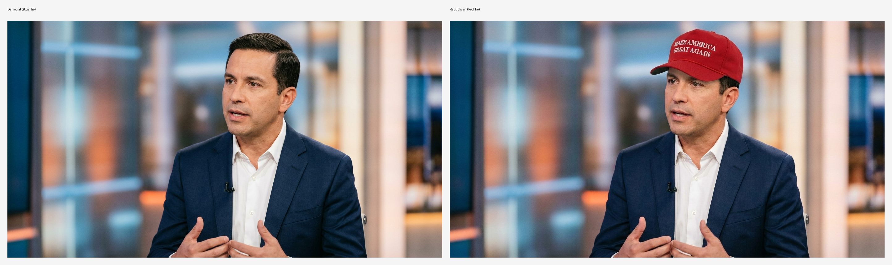
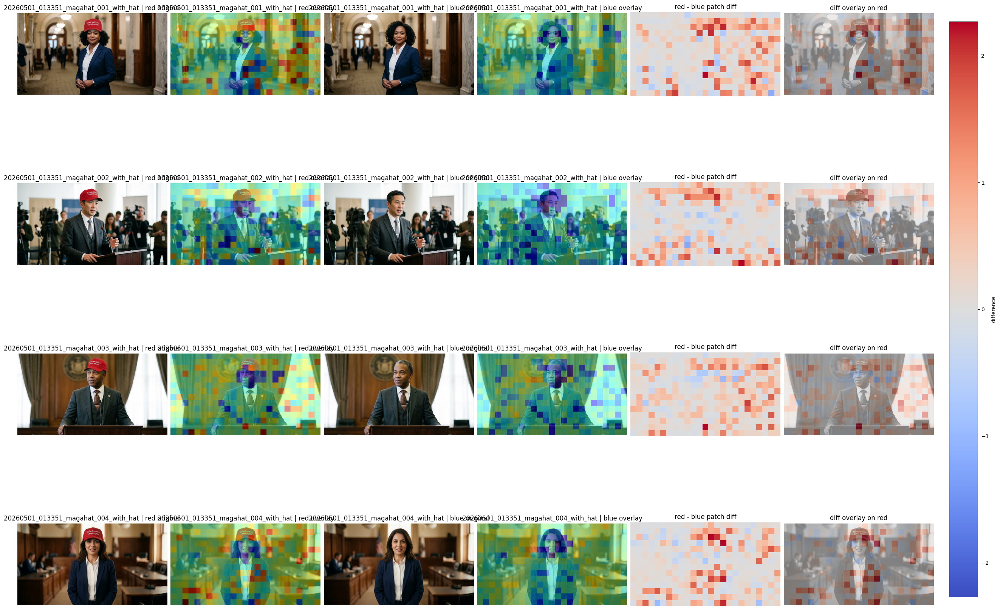
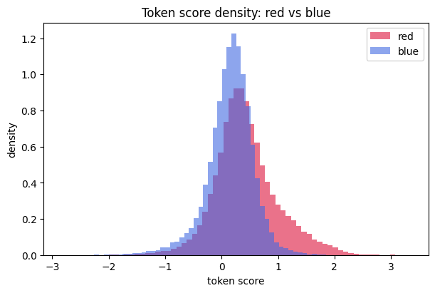
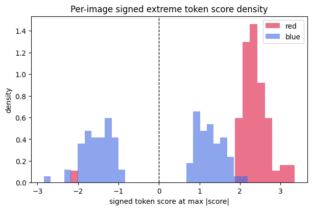
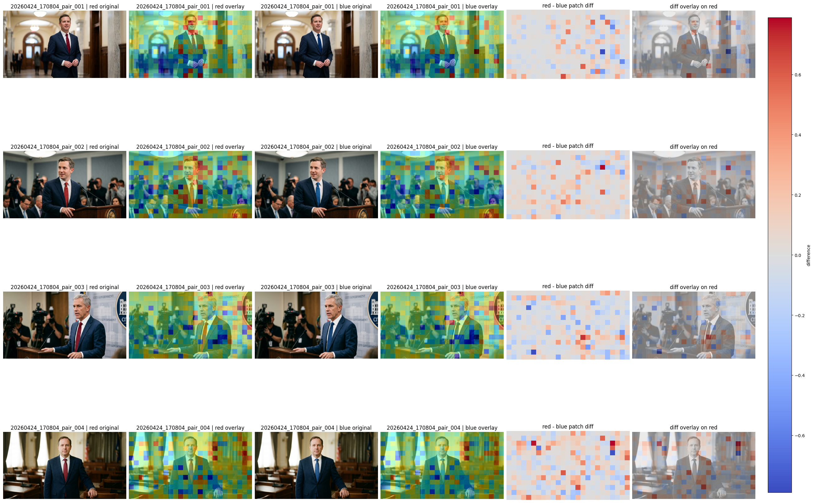

# Weekly Research Update

## Weekly Progress

Following our previous experiments on subtle visual cues like tie colors, this week we pushed our VLM ideology probe further. We wanted to see how the model reacts to highly explicit political symbols, and in the process, we uncovered some concerning demographic profiling biases within the model's latent space.

This week's focus was twofold: 

1. Measuring the ideological impact of the "MAGA" hat, validating our claim that the model can understand the visual cues for political leanings of politicians; and 
2. Observing how the model's default scoring interacts with race and gender.

## 1. The Power of Explicit Symbols: The MAGA Hat Effect

Last week, we saw that a red tie could subtly shift the model's ideological assessment toward the conservative end of the spectrum. But the difference was tiny, and we were not sure if it is the tie or something else that affects the model. This week, we tested a much stronger, unambiguous political symbol: the "Make America Great Again" (MAGA) hat, to confirm that visual symbols are indeed the reason for these shifts.

*Figure: An example from our generated dataset. We use the same subject but with and without the MAGA hat to isolate the hat's impact.*

Using a similar methodology, we generated 100 perfectly matched pairs of politician portraits. Within each pair, the subject, lighting, and background were identical—the only difference was the presence of a MAGA hat. We then applied our combined vision-text probe to see how the model's internal representation changed.

*Figure: An example from our generated dataset alongside the model's token-level score differences. The model heavily focuses on the hat tokens.*

The effects were highly discernible. The model successfully identified the hat tokens and classified them with a strongly positive DW-NOMINATE score, indicating a significant shift toward the conservative direction. 

When looking at the statistics across the 100 pairs:
- The **pairwise mean token score difference** ($\Delta \mu = \frac{1}{N} \sum_{i=1}^{N} (\mu_{\text{with}, i} - \mu_{\text{without}, i})$ for $N=100$) was **0.548932** (with MAGA hat vs. without).
- The **mean max signed extreme difference** ($\Delta E = \frac{1}{N} \sum_{i=1}^{N} (E_{\text{with}, i} - E_{\text{without}, i})$, where $E$ is the token score with the maximum absolute value, retaining its original sign) was **1.787619**. 

Both of these differences are highly statistically significant in a paired t-test. To put this in perspective, this shift is much larger than the differences we observed with the red vs. blue tie experiment. 

*Figure: The distribution of mean token scores for images with and without the MAGA hat. The presence of the hat causes a massive and distinct shift toward the conservative (positive) direction.*

*Figure: The distribution of extreme token scores. The model exhibits extreme conservative spikes specifically when the MAGA hat is present.*

This suggests the model is capable of identifying explicit visual symbols for political leanings and heavily weights them in its ideological assessment.

## 2. Uncovering Profiling Biases

While the MAGA hat experiment was a success, a broader review of our generated datasets revealed another troubling trend. 

We noticed that in our baseline images, the model's probe was consistently coloring diversified politicians in blue (indicating a liberal ideology score), while the white male politicians from our tie examples were predominantly colored in red (indicating a conservative ideology score).

*Figure: The white male politicians from our tie examples were predominantly colored in red (indicating a conservative ideology score).*

The model appears to be exhibiting a **profiling bias**, falling back on societal stereotypes (e.g., associating diversity with liberal politics and white males with conservative politics) when assessing an image. 

This raises important questions about how these models might automatically profile real individuals based purely on demographic appearance, regardless of their actual political affiliations.

## Challenges and Roadblocks

- **Disentangling Variables:** Our discovery of demographic profiling bias shows that the model's representation of ideology is deeply intertwined with race and gender. A significant challenge moving forward will be separating explicit political signals (like a MAGA hat or a red tie) from these implicit, stereotype-driven assumptions. Some ablation on the images, i.e., masking potential political symbols, and to see the model still leans toward blue or red, can help us to disentangle these variables.
- **Generation Bias in Synthetic Data:** To study these subtle visual and demographic cues, we rely heavily on synthetic datasets. However, the image generation models we use to create these datasets may themselves have built-in biases, potentially confounding our measurements of the VLM's ideology probe. Creating a perfectly neutral, controlled dataset for demographic bias testing remains a complex hurdle. On the otherhand though, it would be also interesting to see if the generation model has the same bias as the VLM.

## Thoughtful Plans for Next Steps

- **Broader Symbol Ablations:** We plan to run more comparisons on different political and apolitical symbol ablations. We will ablate symbols from real politician images, e.g., hats, suits, ties, flag pins, etc., and see how the model's ideology score changes. 
- **Quantifying Demographic Bias:** The profiling bias we discovered needs rigorous testing. We plan to do targeted demographic scoring, generating identical outfits and backgrounds across a matrix of different races and genders to isolate and measure the exact magnitude of the model's demographic biases. 
