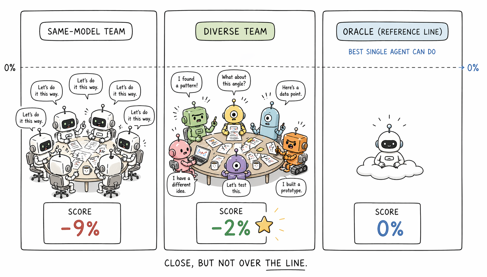
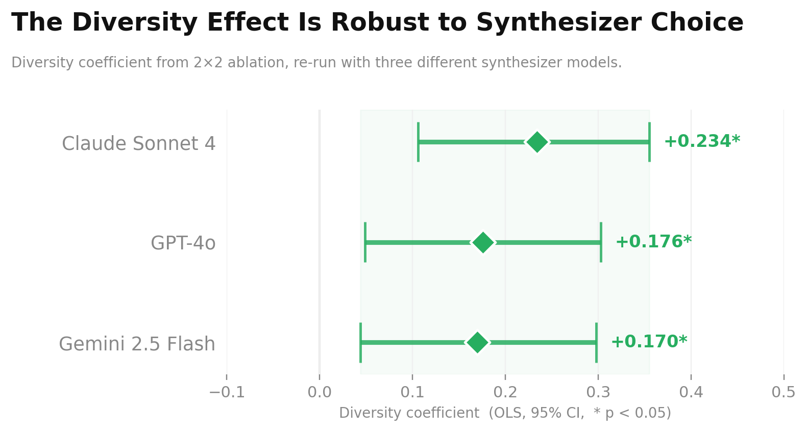
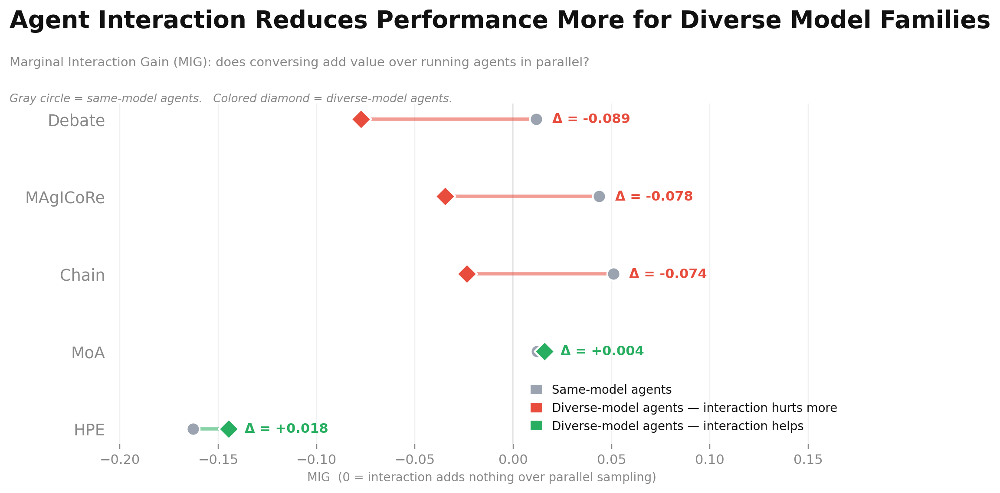

# Blog 3

## Summary of Prior Work

Over the past several weeks, I built a benchmark of nine scientific optimization tasks and ran ten different multi-agent collaboration protocols on each one. By the end of last week, I learned that a simple single-model baseline outranked almost every multi-agent protocol when they were scored by an evaluator that the models could not see. A ran a controlled 2x2 ablation experiment that crossed two binary variables. The first was whether the agents in a protocol came from different AI model families or copies of the same model. The second was whether the protocol included a step that combined the agents' proposals into a single final answer. The first variable was important, but the second one was not. Backbone diversity is when there is a mix of underlying models, and this turned out to be the differentiating feature.

## Protocol Overview

| Protocol | Type | Agents interact? | Diverse models? |
|---|---|---|---|
| Single-shot | Single-agent | N/A | N/A |
| Best-of-N | Single-agent | N/A | N/A |
| Self-Refine | Single-agent | N/A | N/A |
| VGS | Single-agent | N/A | N/A |
| MoA (diverse) | Multi-agent | No | Yes |
| MoA (no synthesis) | Multi-agent | No | Yes |
| MoA (same model) | Multi-agent | No | No |
| Debate | Multi-agent | Yes | No |
| Homo-chain | Multi-agent | Yes | No |
| MAgICoRe | Multi-agent | Yes | No |
| HPE | Multi-agent | Yes | No |
| Cross-chain | Multi-agent | Yes | Yes |

I also ran diverse-backbone variants of Debate, MAgICoRe, HPE, Self-Refine, VGS, Best-of-N, and Homo-chain using GPT-4o, Gemini, DeepSeek, and mixed combinations as the backbone. These are the paired comparisons used in the MIG analysis; each interaction protocol was tested with both same-model and diverse-model agents to isolate the effect of backbone diversity from the effect of interaction.

## Benchmark Design

The benchmark tests whether a structured conversation among multiple AI models produces better solutions to hard scientific problems than the best solution that a single model can come up with using the same compute budget. The intuition behind multi-agent AI is that collaboration should help, in the same way a team of scientists can explore more of a problem than any one of them could. A single model given one attempt at a problem is a weak control, because any multi-agent system compared against it gets credit for advantages that come from sampling a model repeatedly, regardless of whether the agents' collaboration contributes anything. The stronger control in this benchmark samples one model eight independent times and keeps the best attempt. Each multi-agent protocol has to beat that. Compute budgets are held equal across all conditions, so a multi-agent protocol cannot win by spending more total resources than the baseline. Performance is measured by a hidden evaluator that the AI systems cannot see during their attempts, which forces them to solve the underlying problem to score well.

## Central Claim

My central claim after this week is that under matched compute budget and hidden evaluation, conversational multi-agent protocols usually do not outperform a strong single-agent baseline. A protocol is a procedure for organizing how AI models work together, for example by having them debate each other's answers, take votes, or generate separate proposals and combine them. This week's main work was making sure that the evidence for that claim was statistically defensible.

## Aggregate MEG Results

To compare protocols on a common scale, I defined a metric called Aggregate Marginal Epistemic Gain (MEG), measuring how much a multi-agent protocol beats the strongest single-agent control at the same budget. For each protocol on each task, MEG is the gap between the protocol's hidden-evaluator score and the single-agent control's score. Averaging across all nine tasks gives one number per protocol (i.e., the Aggregate MEG). A positive value means the protocol beats single-agent on average, and a negative value means single-agent wins. None of the ten protocols produced a positive Aggregate MEG. The best performer was a diverse Mixture-of-Agents (MoA) configuration at -0.022, which was the only one whose 95% confidence interval was positive.

My subsequent experiment tests why the protocols fail, using MoA, a protocol in which several AI models each produce a candidate answer and a separate synthesizer model combines them into a final answer. The first experimental variable is whether the proposing agents come from different model families (Claude, GPT, Gemini) or are copies of the same model. The second variable is whether the synthesis step runs, or whether the pipeline picks the single best-scoring proposal and discards the others. Crossing the two yields four conditions, run on three tasks for 120 total runs. Model-family diversity produced a coefficient of +0.188 with a 95% confidence interval of [+0.064, +0.309]. Synthesis produced a coefficient of -0.010 with a confidence interval that straddles zero by a wide margin. A bootstrap analysis, which resamples the data to check robustness, found that diversity outweighed synthesis in 99.9% of resamples. That means that, in MoA, the part that actually helps is using different models to generate distinct proposals.

The main experiment always used the same synthesizer model, so the null effect of synthesis might hold only for that particular one. To check, I reran the synthesis conditions with three different synthesizers (Claude Sonnet 4, GPT-4o, and Gemini 2.5 Flash). The diversity coefficient stayed positive and of similar magnitude in all three, which indicates that the finding does not depend on which model does the combining.

## MIG and Interaction Effects

A second metric, Marginal Interaction Gain (MIG), measures whether the exchanges between agents in a protocol add anything once the set of agents is fixed. A protocol that scores higher than running the same agents in parallel and picking the best output is getting value from interaction. One that does not is getting nothing or being actively hurt. Across almost every protocol tested, interaction was more harmful with diverse agents than with same-model agents. A debate protocol, in which agents argue against each other's answers and revise, had a MIG of +0.012 with same-model agents and -0.078 with diverse ones. MAgICoRe, which uses iterative self-correction with critique steps, went from +0.044 to -0.035 on the same axis. The only exceptions were MoA and HPE. MoA is a genuine exception where diverse agents do better because their differences stay intact through to the final answer. HPE is a different kind of exception where its same-model MIG is already -0.163, the worst of any protocol, meaning the peer evaluation mechanism itself destroys solutions regardless of diversity. The only exception was MoA, where the diverse version scored +0.016 and the same-model version +0.012. MoA avoids this because agents never see each other's proposals. Each submits independently, so their different perspectives stay intact until the final synthesis step. This suggests that diverse agents start with different ideas, but many interaction protocols make them converge before those differences improve the final solution.

## Composability Predictions

I wanted to explain why diversity helped on some tasks in the benchmark, since diversity should help when different agents can produce partial answers that fit together, and it should help less when those partial answers usually conflict. To test that idea, I labeled two new tasks before running any experiments. Max Coverage was a case where different agents could contribute compatible pieces, so we predicted a positive diversity effect. The observed effect was positive, which matches the prediction, but it was smaller than the pre-specified threshold. Latin Square was a case where partial solutions from different agents usually conflict with each other, so we predicted that diversity would not help. The observed effect was negative, which matches that prediction. The two tasks support the sign pattern of the hypothesis, with stronger evidence for Latin Square than for Max Coverage.

## Comparison with Einstein Arena

For the Einstein Arena blog by [Together.ai](https://www.together.ai/blog/einsteinarena), their multi-agent system produced eleven new best-known results on open mathematical problems, including an improved construction for the kissing number in eleven dimensions that no single agent reached alone. The improvement required a chain of agents collaborating over 48 hours, with each agent building on what the previous agent had found. Einstein Arena agents share intermediate constructions over an extended time horizon, and each agent refines a specific prior result. The protocols in my benchmark run within a single session and combine independent proposals through a fixed synthesis step. On Difference Bases and Erdős Overlap, which appear in both benchmarks, my diverse MoA protocol does outperform single-agent by +9% and +2%, consistent with what Einstein Arena observes on those same problems. One interpretation is that the value of multi-agent collaboration depends on whether agents build on each other's specific partial results or independently generate proposals to be merged. My benchmark tests the second. Whether that interpretation generalizes is an open question, and the two sets of results are consistent with each other.

## Conclusion

Under matched compute budget and hidden evaluation, no conversational multi-agent protocol in the benchmark reliably beats a strong single-agent baseline across all ten protocols and all nine tasks. Within MoA, the controlled experiment that isolated the effects of diversity and synthesis found model-family diversity is the only statistically significant factor, with a coefficient of +0.188 that stays positive across three synthesizer models. The synthesis step produces a coefficient of -0.010 and contributes nothing measurable. Across almost every protocol family, the interaction step specifically hurts diverse agents more than same-model agents, which explains why the diversity signal from the proposal stage does not survive to the final output. The composability work, which predicted in advance whether diversity should help or hurt on two new tasks, shows that the coverage task showed a positive effect of +0.022, in the predicted direction. This effect fell short of the pre-specified threshold of +0.10, so the result counts as directional confirmation only. The Latin Square task showed a clearly negative effect, also in the predicted direction.

In conclusion, a group does not become epistemically stronger just by sharing information. It becomes stronger only if sharing does not erase the informational independence that made the group valuable.
